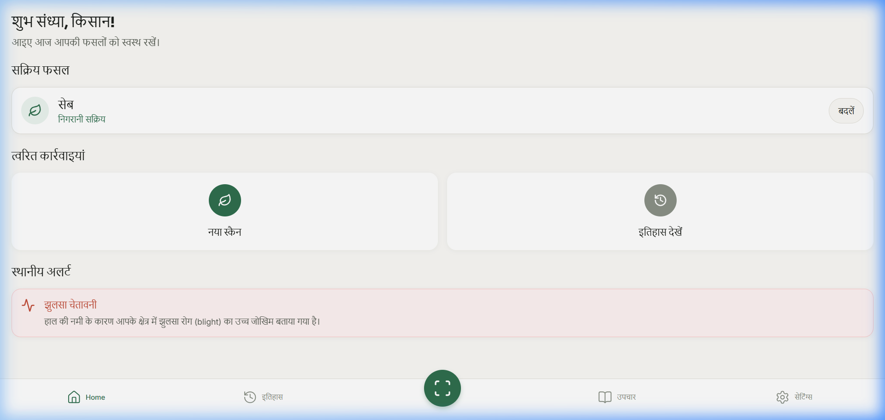
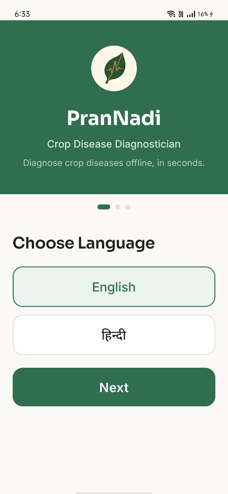
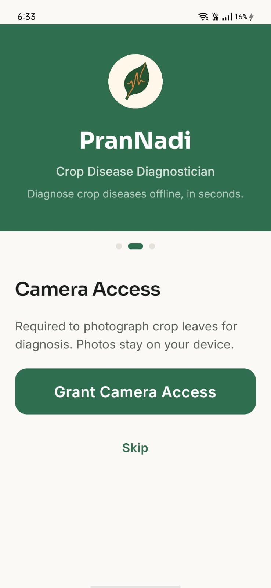
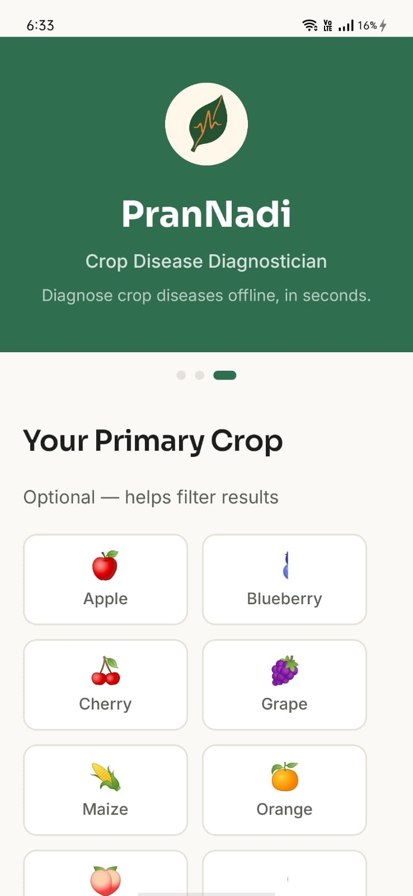
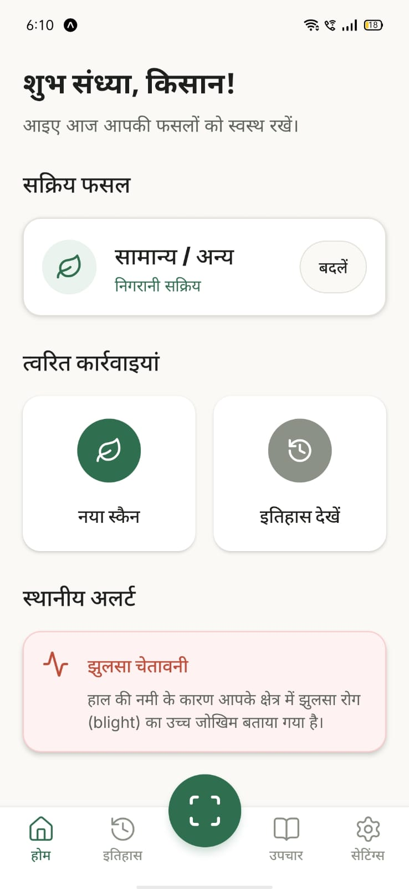
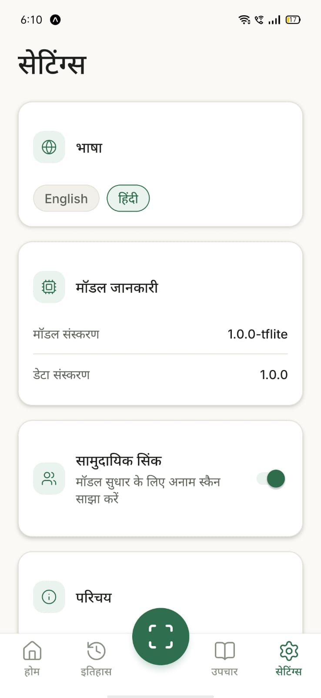
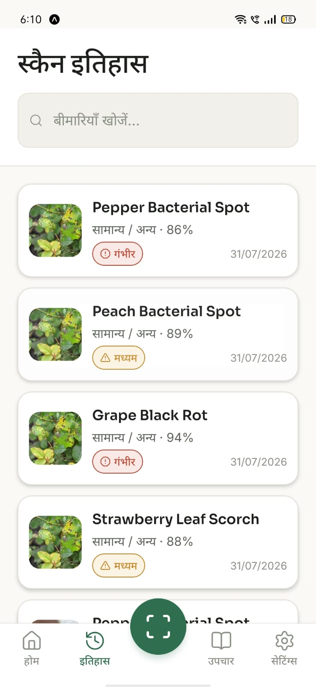
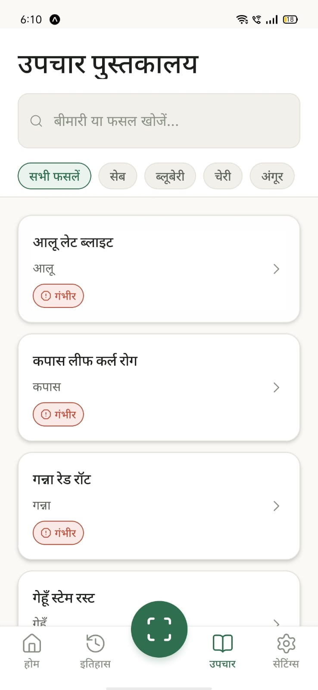
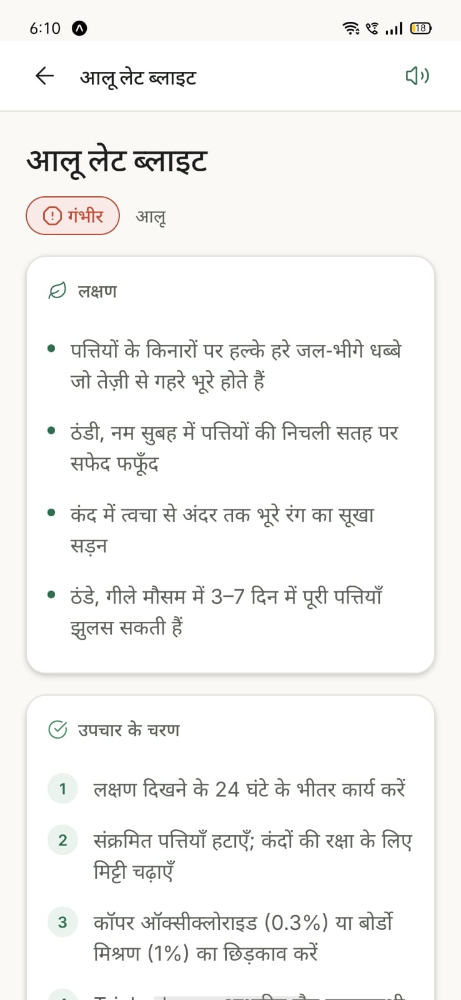

<div align="center">

# 🌿 PranNadi — Crop Disease Diagnostician

**Diagnose crop diseases offline, in seconds.**

An AI-powered mobile app that identifies 38+ crop diseases from a single leaf photo — no internet required. Built for Indian farmers, available in English & Hindi.

[](https://drive.google.com)
[](https://reactnative.dev)
[](https://expo.dev)
[](https://www.tensorflow.org/lite)
[](LICENSE)

</div>

---

## 📲 Scan & Download

<div align="center">



**Scan the QR code above to download the app from Google Drive**

</div>

---

## 📸 App Screenshots

<div align="center">

### 🚀 Onboarding Flow

| Language Selection | Camera Permission | Crop Selection |
|:---:|:---:|:---:|
|  |  |  |

---

### 🏠 Home & Navigation (Hindi)

| Home Dashboard | Settings | Scan History |
|:---:|:---:|:---:|
|  |  |  |

---

### 💊 Remedy Library & Disease Details (Hindi)

| Remedy Library | Disease Detail |
|:---:|:---:|
|  |  |

</div>

---

## ✨ Key Features

| Feature | Description |
|---|---|
| 🤖 **AI-Powered Diagnosis** | On-device TFLite MobileNetV2 model trained on 87,000+ images across 38 disease classes |
| 📴 **100% Offline** | No internet required — works in remote farmlands |
| 🌍 **Bilingual** | Full English & Hindi support — all UI, remedies, and alerts translate instantly |
| 📷 **Camera & Gallery** | Scan live using camera or pick from photo gallery |
| 💊 **Remedy Library** | Detailed symptoms, step-by-step treatment, and preventive tips for every disease |
| 🔊 **Text-to-Speech** | Listen to remedy instructions — great for low-literacy users |
| 📊 **Scan History** | Track all past diagnoses with thumbnails, confidence scores, and dates |
| ⚡ **Tiny APK** | ~20 MB per-architecture APK thanks to ABI splits and ProGuard |
| 🎨 **Premium UI** | Elegant glassmorphism cards, smooth animations, and a floating Scan FAB |

---

## 🏗️ Tech Stack

| Layer | Technology |
|---|---|
| **Framework** | React Native 0.76 + Expo SDK 53 |
| **Navigation** | Expo Router (file-based tabs) |
| **ML Engine** | TensorFlow Lite via `react-native-fast-tflite` |
| **State** | Zustand + AsyncStorage |
| **i18n** | react-i18next (EN / HI) |
| **UI** | Custom design system (Inter + Sora fonts, hand-tuned color palette) |
| **Training** | PyTorch → ONNX → TFLite (see `ml-training/`) |

---

## 🗂️ Project Structure

```
PranNadi/
├── app/                          # Expo app
│   ├── app/                      # File-based routing
│   │   ├── (tabs)/               # Tab screens (Home, History, Scan, Remedies, Settings)
│   │   ├── remedy/[diseaseId].tsx # Remedy detail screen
│   │   ├── result/[scanId].tsx    # Diagnosis result screen
│   │   └── onboarding/           # First-launch onboarding
│   ├── src/
│   │   ├── ml/                   # TFLite classifier, preprocessing, labels
│   │   ├── services/             # Inference & remedy services
│   │   ├── data/                 # Remedy JSON databases (EN + HI)
│   │   ├── design-system/        # Colors, typography, spacing, motion
│   │   ├── components/           # Reusable UI components
│   │   ├── store/                # Zustand state management
│   │   └── i18n/                 # Translation files
│   ├── assets/                   # App icons, images, screenshots
│   └── plugins/                  # Custom Expo config plugins
│
└── ml-training/                  # Model training pipeline
    ├── train.py                  # PyTorch training script
    ├── evaluate.py               # Model evaluation
    └── export_tflite.py          # TFLite conversion
```

---

## 🚀 Getting Started

### Prerequisites

- Node.js 18+
- Expo CLI (`npm install -g expo-cli`)
- Android device or emulator

### Installation

```bash
# Clone the repository
git clone https://github.com/ritikkalal07/PranNadi.git
cd PranNadi/app

# Install dependencies
npm install

# Start the development server
npx expo start
```

### Build APK

```bash
# Install EAS CLI
npm install -g eas-cli

# Build preview APK
npx eas build -p android --profile preview
```

---

## 🌾 Supported Crops & Diseases

The app currently supports **38+ diseases** across **20 crops**:

| Crop | Diseases Detected |
|---|---|
| 🍎 Apple | Scab, Black Rot, Cedar Rust, Healthy |
| 🫐 Blueberry | Healthy |
| 🍒 Cherry | Powdery Mildew, Healthy |
| 🍇 Grape | Black Rot, Esca, Leaf Blight, Healthy |
| 🍊 Orange | Citrus Greening |
| 🍑 Peach | Bacterial Spot, Healthy |
| 🌶️ Pepper | Bacterial Spot, Healthy |
| 🥔 Potato | Early Blight, Late Blight, Healthy |
| 🫘 Soybean | Healthy |
| 🍓 Strawberry | Leaf Scorch, Healthy |
| 🍅 Tomato | Early Blight, Late Blight, Bacterial Spot, Leaf Mold, Septoria, Spider Mites, Target Spot, Mosaic Virus, Yellow Leaf Curl, Healthy |
| 🌾 Rice | Blast, Brown Spot, Leaf Blight |
| 🌾 Wheat | Stem Rust, Leaf Rust, Powdery Mildew |
| 🌽 Maize | Common Rust, Northern Blight, Gray Leaf Spot, Healthy |
| 🥜 Groundnut | Early Leaf Spot, Late Leaf Spot, Rust |
| 🌿 Cotton | Leaf Curl Virus, Bacterial Blight |
| 🌶️ Chilli | Leaf Curl, Anthracnose |
| 🎋 Sugarcane | Red Rot, Smut |

---

## 🤝 Contributing

Contributions are welcome! Please open an issue or submit a PR.

1. Fork the repository
2. Create your feature branch (`git checkout -b feature/amazing-feature`)
3. Commit your changes (`git commit -m 'Add amazing feature'`)
4. Push to the branch (`git push origin feature/amazing-feature`)
5. Open a Pull Request

---

## 📄 License

This project is licensed under the MIT License — see the [LICENSE](LICENSE) file for details.

---

<div align="center">

**Made with 💚 for Indian farmers**

*PranNadi — प्राणनाड़ी — The pulse of life*

</div>
