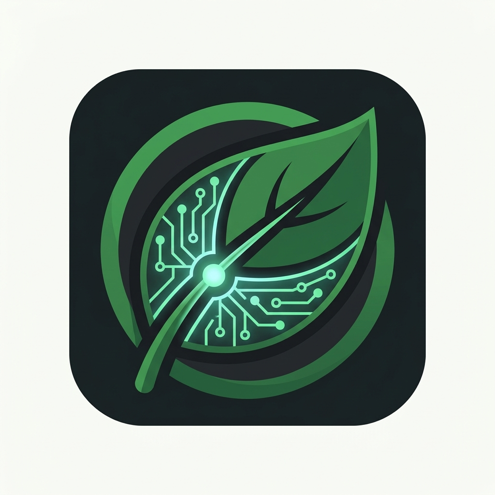

<div align="center">
  
  <h1>PranNadi</h1>
  <p><strong>Empowering Farmers with Offline, AI-Driven Crop Disease Diagnosis</strong></p>
</div>

<br />

## 🌾 The Problem
Crop diseases cause devastating losses globally, particularly in remote regions where farmers lack immediate access to expert agronomists and reliable internet. When an outbreak occurs, delayed diagnosis leads to reduced yields, economic hardship, and food insecurity.

## 🚀 The Solution: PranNadi
**PranNadi** is a hyper-local, offline-first mobile application designed to democratize agricultural expertise. By harnessing edge AI and decentralized communication, it acts as an intelligent, pocket-sized agronomist that works even in the most remote fields.

### 🔥 Key Features & Hackathon Differentiators
- **100% Offline AI Inference**: We run a quantized TensorFlow Lite model directly on the device. No internet required for diagnosis!
- **Zero-Latency Scanning**: A custom-built, continuous camera frame processor evaluates crop health in real-time.
- **Multilingual Voice Output**: Automatically translates and reads diagnosis results aloud (Text-to-Speech) in the farmer's native language (e.g., Hindi, Gujarati, English), bridging the literacy gap.
- **Outbreak Alerts**: (Mocked) A decentralized alert system that warns neighboring farmers of hyper-local disease clusters.
- **Field Vigor Analytics**: Real-time NDVI estimations to evaluate overall farm health.

---

## 🛠️ Tech Stack
- **Framework**: React Native + Expo (SDK 54)
- **Navigation**: Expo Router (File-based routing)
- **State Management**: Zustand
- **Local Database**: SQLite (for offline history & tracking)
- **Machine Learning**: TensorFlow Lite (`react-native-fast-tflite`)
- **Camera & Vision**: Expo Camera & Skia

---

## 📱 How to Run the App (Expo Go)

1. **Clone the Repository**
   ```bash
   git clone https://github.com/your-username/PranNadi.git
   cd PranNadi/app
   ```

2. **Install Dependencies**
   ```bash
   npm install
   ```

3. **Start the Development Server**
   ```bash
   npx expo start -c
   ```

4. **Scan the QR Code**
   - Download the **Expo Go** app on your iOS or Android device.
   - Scan the QR code presented in the terminal to launch PranNadi!

---

## 📁 Repository Structure

```
PranNadi/
├── app/                  # The main React Native mobile application
│   ├── app/              # Expo Router screens (Tabs, Modals)
│   ├── src/              # Services, Stores, Components, and Utils
│   └── assets/           # Logos, icons, and fonts
├── ml-training/          # Python scripts for dataset curation & TFLite model training
└── docs/                 # Detailed architectural and specification documents
```

---

<div align="center">
  <p><i>Built with passion for agriculture & technology.</i></p>
</div>
